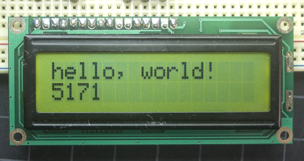
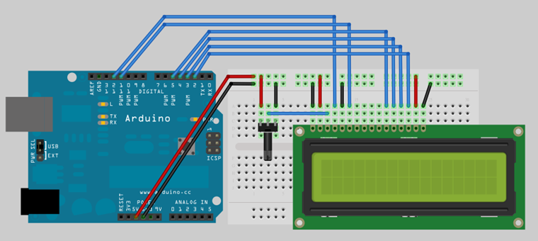
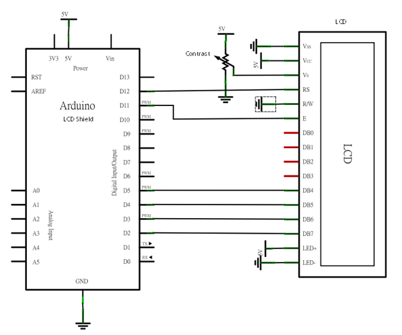

## Arduino入門教學(9) – 在 2x16 LCD 上顯示 "Hello World" 訊息 (作者：Cooper Maa)

### 實驗目的

練習使用 HD44780 相容的文字型 LCD(Liquid crystal display)，在 2x16 LCD 上顯示 "Hello World” 訊息。

### 2x16 LCD 簡介



HD44780 相容的 2x16 LCD 可以顯示兩行訊息，每行 16 個字元，它可以顯示英文字母、希臘字母、標點符號以及數學符號，除了顯示訊息外，它還有其它功能，包括訊息捲動(往左和往右捲動)、顯示游標和 LED背光等。


LCD 總共有 14 支接腳，如果內建背光的話是 16 支，這些腳位的功能整理於下表:

腳位編號    名稱                                           說明
---------   -----------------------------------------      --------------------------------------------------------------------------
1           Vss                                            接地 (0V)
2           Vdd                                            電源 (+5V)
3           Vo 或稱 Vee                                    對比(0-5V), 可接一顆 1k 電阻，或利可變電阻調整適當的對比
4           RS                                             Register Select:  1: D0 – D7 當作資料解釋  0: D0 – D7 當作指令解釋
5           R/W                                            Read/Write mode:  1: 從 LCD 讀取資料  0: 寫資料到 LCD, 因為很少從 LCD 這端讀取資料，可將此腳位接地以節省 I/O 腳位。
6           E                                              Enable
7           D0                                             Bit 0 LSB
8           D1                                             Bit 1
9           D2                                             Bit 2
10          D3                                             Bit 3
11          D4                                             Bit 4
12          D5                                             Bit 5
13          D6                                             Bit 6
14          D7                                             Bit 7 MSB
15          A+                                             背光(串接 330R 電阻到電源)
16          K-                                             背光(GND)

日立 HD44780 相容的 LCD 有 4-bit 和 8-bit 兩種使用模式，使用 4-bit 模式主要的好處是節省 I/O 腳位，通訊的時候只會用到 4 個高位元 (D4-D7)，D0-D3 這四支腳位可以不用接。每個送到 LCD 的資料會被分成兩次傳送 – 先送 4 個高位元，然後才送 4 個低位元。

### 材料

* 麵包板 x 1
* Arduino 主板 x 1
* HD44780 相容 LCD x 1  (本文所用的為 14 pin 無背光 LCD)
* 旋轉式可變電阻 x 1
* 單心線 x N

### 接線

* 將 LCD 的 RS, Enable, D4, D5, D6, D7 依序接到 12, 11, 5, 4, 3, 2 等腳位上
* 將 LCD 的 Vss 及 R/W 接到 GND，Vdd 接到 +5V
* 可變電阻中間腳位接到 LCD 的 Vo，剩下的兩支腳位，一支接到 5V，另外一支接到 GND (註：也可以不使用可變電阻，只要在 LCD 的 Vo 上串接一顆 1k ohm 電阻連到 GND 即可)



### 電路圖



### 程式碼

要在 LCD 上顯示訊息，會涉及初始化 LCD 、下指令以及傳送資料給 LCD 等工作，Arduino LiquidCrystal Library 已經把這些工作簡化了，所以你不需要知道這些低階的指令。底下的程式在 2x16 LCD 上第一行顯示 "hello, world!” 訊息，並在第二行不斷更新 Arduino 重開之後經過的秒數，使用的是 4-bit 模式(HelloWorld.pde):

```CPP

/* Lab9 - 在 2x16 LCD 上顯示 "Hello World" 訊息  
  The circuit:
 * LCD RS pin to digital pin 12
 * LCD Enable pin to digital pin 11
 * LCD D4 pin to digital pin 5
 * LCD D5 pin to digital pin 4
 * LCD D6 pin to digital pin 3
 * LCD D7 pin to digital pin 2
 * 10K Potentiometer:
 * ends to +5V and ground
 * wiper to LCD VO pin (pin 3)
 
 This example code is in the public domain.
 http://www.arduino.cc/en/Tutorial/LiquidCrystal
 */

// 引用 LiquidCrystal Library
#include <LiquidCrystal.h>

// 建立 LiquidCrystal 的變數 lcd
//                 LCD 接腳:  rs, enable, d4, d5, d6, d7  
//      對應到 Arduino 接腳:  12,     11,  5,  4,  3,  2
LiquidCrystal lcd(12, 11, 5, 4, 3, 2);

void setup() {
  // 設定 LCD 的行列數目 (2 x 16)
  lcd.begin(16, 2);

  // 列印 "Hello World" 訊息到 LCD 上
  lcd.print("hello, world!");
}

void loop() {
  // 將游標設到 column 0, line 1
  // (注意: line 1 是第二行(row)&#65292;因為是從 0 開始數起):
  lcd.setCursor(0, 1);

  // 列印 Arduino 重開之後經過的秒數
  lcd.print(millis()/1000);
}
```

如果訊息沒有顯示在螢幕上，或者是模糊朦朧的，首先應該做的事是檢查可變電阻以調整對比。

註：這支是 Arduino 內建的範例程式，點選 File > Examples > LiquidCrystal > HelloWorld 就可以找到。

### 範例照片／影片

* Arduino 筆記 -- Lab9 在 2x16 LCD 上顯示 "Hello World" 訊息 -- <http://youtu.be/jUbNR54mfgM>

### 動動腦

1. 接一顆光敏電阻或可變電阻，然後寫一支程式讀取光敏電阻或可變電阻的讀值，並將讀到的數值顯示在 LCD 上。
2. 寫一支 SerialLCD 程式，程式的邏輯是： 接受來自 Serial Port 的資料(從 PC 或筆電端送出)，然後把資料顯示在 LCD 上。
3. 承上題，把 SerialLCD 變成一個網路型的 LCD，讓電腦透過網路就可以把資料丟到 LCD 上顯示。

### 延伸閱讀

* [How to control a HD44780-based Character LCD](http://home.iae.nl/users/pouweha/lcd/lcd.shtml)
* [ladyada – Wiring up a character LCD to Arduino](http://www.ladyada.net/learn/lcd/charlcd.html)
* [LCD 101](http://www.spikenzielabs.com/SpikenzieLabs/LCD_How_To.html)
* [Scroll](http://arduino.cc/en/Tutorial/LiquidCrystalScroll) : scroll text left and right.
* [Autoscroll](http://arduino.cc/en/Tutorial/LiquidCrystalAutoscroll) : shift text right and left.

【本文作者為馬萬圳，原文網址為： <http://coopermaa2nd.blogspot.tw/2010/12/arduino-lab9-2x16-lcd-world.html> ，由陳鍾誠編輯後納入本雜誌】
