8月份 Taiwan R User Group 講題分享: 利用R和Shiny製作網頁應用
========================================================


# 簡介Shiny

大家好，這篇文章要跟大家分享的是Rstudio這間公司在2012年釋出的R 套件: **Shiny**。

Shiny的設計目標，是希望讓不懂網頁技術的R使用者，可以用最短的時間，將他們的分析結果呈現在網站上和使用者互動。而且，透過Shiny，開發者只需要懂R的語法，就可以寫網頁了！（報告學長，完全不用學HTML，完全不用學javascript）

推出至今，在R社群內獲得廣大的迴響。在這篇文章中，我們將介紹近期最火紅的R套件: Shiny，並希望讀者能在閱讀後，獲得使用Shiny來建立網頁應用的能力，以更多元的方式呈現分析結果。

# Hello Shiny

使用的第一步，當然是先到CRAN下載Shiny來安裝，並且試著執行範例(請一定要在本機上執行，在遠端伺服器上執行會出錯):


```r
library(shiny)
runExample("01_hello")
```


執行後會自動打開預設瀏覽器，並看到如圖一顯示的網頁。讀者可以試著拉拉看左上角的拉條(slide bar)來調整數量，右邊的圖片會隨著更新！這就是Shiny所強調的互動式網頁應用。

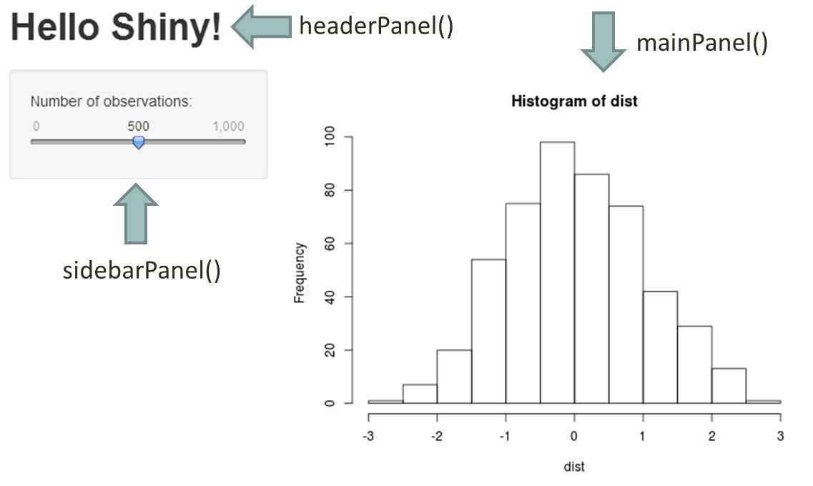

Shiny也提供網頁模版供開發者使用。圖一中使用的模版`pageWithSidebar`，將網頁切割為以下三個部份：
- 標題，也就是*Hello Shiny!*
- 控制面板(輸入)，左上角的灰色區塊
- 顯示面板(輸出)，右半邊的圖片

`runExample("01_hello")`的效果等同於在目錄下建立以下兩個檔案:

ui.R:


```r
library(shiny)

# Define UI for application that plots random distributions 
shinyUI(pageWithSidebar(

  # Application title
  headerPanel("Hello Shiny!"),

  # Sidebar with a slider input for number of observations
  sidebarPanel(
    sliderInput("obs", 
                "Number of observations:", 
                min = 1,
                max = 1000, 
                value = 500)
  ),

  # Show a plot of the generated distribution
  mainPanel(
    plotOutput("distPlot")
  )
))
```


server.R:


```r
library(shiny)

# Define server logic required to generate and plot a random distribution
shinyServer(function(input, output) {
    
    # Expression that generates a plot of the distribution. The expression is
    # wrapped in a call to renderPlot to indicate that:
    # 
    # 1) It is 'reactive' and therefore should be automatically re-executed
    # when inputs change 2) Its output type is a plot
    output$distPlot <- renderPlot({
        
        # generate an rnorm distribution and plot it
        dist <- rnorm(input$obs)
        hist(dist)
    })
})
```


接著再執行:


```r
runApp()
```


以下本文將以「Hello Shiny!」為例介紹Shiny的架構。

# Shiny的架構

所有Shiny的網頁應用，都可以切割成兩個部份：

1. 使用者在瀏覽器看到的網頁，這部份的程式碼放在ui.R。實際上網頁的呈現，以及互動式的效果，都是由瀏覽器所執行。
1. 背景執行的R，這部份的程式碼放在server.R。這裡的R 是由開發者於佈署網頁應用時就啟動的，並靜靜地等待瀏覽器傳送參數。

瀏覽器和R 之間，則是透過網路來溝通。

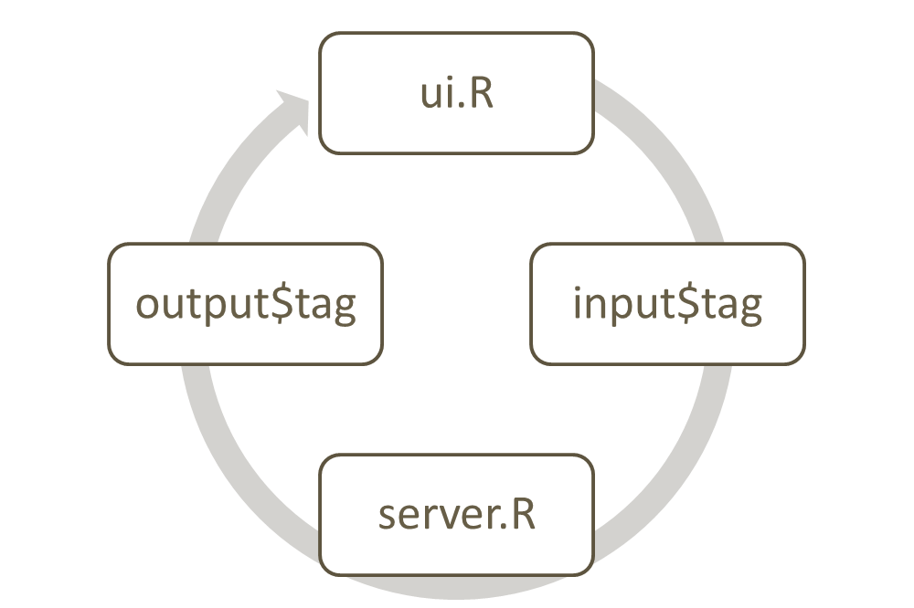

當使用者打開瀏覽器，連接到Shiny應用程式時，R 會依照ui.R中的程式碼，產生出使用者看到的網頁內容，並在瀏覽器中顯示。

使用者在控制面板更改參數之後，瀏覽器就會將新的參數傳遞給背景執行的R，也就是server.R 。R 就會依照參數和server.R中的程式碼，產生對應的物件。這物件可能是圖片、報表，甚至是其他的網頁元件。最後server.R會將物件回傳到瀏覽器，以ui.R定義的方式呈現給使用者。這就是互動式網頁背後的原理。

## ui.R

當使用者打開網頁之後，R 會將`shinyUI`的參數轉換成瀏覽器中的網頁元件。`shinyUI`的參數都對應到一個網頁元件，而這些物件的參數又分別對應到元件中的元件，形成一種巢狀結構。

第一個元件: `pageWithSidebar`提供了預設的模版，裏面包含三個參數:


```r
str(pageWithSidebar)
```

```
## function (headerPanel, sidebarPanel, mainPanel)
```


- `headerPanel`對應到上圖中標題部份的網頁元件，也就是*Hello Shiny!*
- `sidebarPanel`對應著控制面板(輸入)部份的網頁元件，也就是左上角的灰色區塊
- `mainPanel`對應著顯示面板(輸出)部份的網頁元件，也就是右半邊的圖片

這裡的`headerPanel`是比較簡單的，我們只要把要當標題的字串物件傳入，就可以設定網頁的標題了。

`sidebarPenl`和`mainPanel`中則可以再放入其他的網頁元件。

### `sidebarPanel`


```r
str(sidebarPanel)
```

```
## function (...)
```


`sidebarPanel`函數接受任意數量的參數，而每一個參數就是顯示在網頁上控制面板的元件。

Shiny提供了幾乎所有基本的網頁輸入(Input)元件。上圖中使用的`sliderInput`元件，是供使用者透過拉條(slide bar)來輸入數值參數。


```r
str(sliderInput)
```

```
## function (inputId, label, min, max, value, step = NULL, round = FALSE, 
##     format = "#,##0.#####", locale = "us", ticks = TRUE, animate = FALSE)
```


`inputId`非常重要，是瀏覽器和server.R溝通的依據。請讀者先記得，上圖範例中的`sliderInput`元件的`inputId`叫作`"obs"`，之後會在server.R中看到對應的`input$obs`。

其他的參數，則會依據不同的輸入元件而有不同的意義。請讀者再參閱Shiny的說明文件，在此就不一一解釋。

### `mainPanel`


```r
str(mainPanel)
```

```
## function (...)
```


`mainPanel`函數也接受任意數量的參數，而每一個參數就是在網頁上顯示面板的元件。

Shiny也提供數種不同的輸出元件，從基本的文字輸出，到圖、表、HTML元件和javascript。圖一中的`plotOutput`就是輸出圖片的元件。


```r
str(plotOutput)
```

```
## function (outputId, width = "100%", height = "400px")
```


這裡的`outputId`非常重要，也是瀏覽器和server.R溝通的依據。請讀者先記得，上圖範例中的`plotOutput`元件的`outputId`叫作`"distPlot"`。之後會在server.R中看到對應的`output$distPlot`。

## server.R

server.R定義了背景執行的R 如何處理瀏覽器傳遞來的參數，以及如何產生對應的R 物件。為了建立互動式的效果，server.R和一般R 的程式是不同的。

server.R 是一種依照事件驅動(event driven)的架構來執行的程式。當開發者在伺服器上啟動Shiny時，R會先執行`shinyServer`之前的程式碼，再進入等待狀態。

### 事件驅動(event driven)

`shinyServer`中的程式碼，會等使用者打開網頁，並待瀏覽器傳送參數給R 之後，R才會依照`reactive`或是`renderXXX`等函數中定義的方式來處理這些參數，並且產生對應的物件。R 會再回傳給瀏覽器，並依照ui.R所定義的方式呈現。R 會再回到等待狀態，直到收到下一組參數。

收到參數，就是一個「事件」，而所有的動作都是在收到事件後才會發生的。所以程式碼的執行是沒有一定的順序。這就是「事件驅動」架構的原理。

### `shinyServer`


```r
str(shinyServer)
```

```
## function (func)
```


`shinyServer`只有一個函數參數: `func`。它的長相必須是:

```r
function(input, output) { ... }
```

`input`代表ui.R送給server.R的物件；`output`代表server.R送給ui.R的物件。

Shiny幫開發者處理`input`和`output`的傳遞，所以開發者只需要專注於設計ui.R呈現的功能，和server.R處理參數以及產生回應的功能即可。

### 訊息的傳遞

`func`的參數`input`就是將ui.R傳遞回來的參數打包好的R物件，開發者只要透過`input$obs`就可以讀取使用者於控制面板中，`inputId`為`"obs"`的元件內的參數。

`func`的參數`output`則是會被送回給ui.R的物件。而`output$distPlot`這個物件，則會由`outputId`為`"distPlot"`的網頁元件來處理。

### 生成回傳物件(應用的核心)

開發者利用如

```r
output$distPlot <- renderPlot({...})
```

的方式定義產生回傳物件的動作。以Hello Shiny!為例:

```r
output$distPlot <- renderPlot({
	dist <- rnorm(input$obs)
	hist(dist)
})
```

當偵測到`input$obs`改變之後，server.R就會依照`input$obs`的值重新繪製長條圖，再將圖片透過`renderPlot`函數，傳遞給瀏覽器。瀏覽器再透過ui.R中的定義，使用`outputId`為`"distPlot"`的網頁元件呈現給使用者。在Hello Shiny!的例子中，就是`plotOutput("distPlot")`所對應的網頁元件，也就是使用者在圖一右半邊看到的長條圖。

繪圖的功能置於`renderPlot({...})`是重要的，因為這樣才會在事件發生(接收到ui.R的參數)後，重新執行繪圖功能，並更新網頁上的圖。Shiny互動式的功能就是透過這個機制達成的。開發者必須要分清楚哪些程式碼是靜態的，只需要執行一次(例如固定資料的匯入)，哪些程式碼是動態的，必須要放入`reactive`或`renderXXX`之間。

# 細解Hello Shiny

對於整個Shiny的架構有初步的理解之後，我們再仔細的講解Shiny處理`runExample("01_hello")`的流程。

1. 執行`shinyUI`之前的程式碼
1. 將頁面區隔為三大區塊: `headerPanel`、`sidebarPanel`和`mainPanel`
1. 依照各Panel的參數顯示網頁元件，這時候`mainPanel`中的`plotOutput("distPlot")`還沒有物件可以呈獻。
1. `sidebarPanel`中的`sliderInput`傳送預設參數給server.R
1. 啟動server.R，執行`shinyServer`之前的程式碼
1. 執行`renderPlot({...})`之間的程式碼，也就是:

    ```r
    dist <- rnorm(input$obs)
    hist(dist)
    ```

    依照`sliderInput`設定的參數，產生常態分佈的樣本，並且繪製長條圖(histogram)。
1. 將產生的長條圖放入`output$distPlot`之中，回傳到瀏覽器
1. 瀏覽器將`output$distPlot`的物件呈現於`plotOutput("distPlot")`之中

若使用者於瀏覽器更動`sliderInput`，那整個網頁應用就會從步驟4再跑一次，以實現互動式的效果。

# 網頁元件範例

Shiny 中已經提供了各種基礎網頁元件。還有一個叫*shinyExt*的R 套件提供更多的元件。

本篇文章限於篇幅，無法一一講解，這部份只能請讀者依照自己的需求再去閱讀Shiny的套件說明。

## 輸入元件範例

- 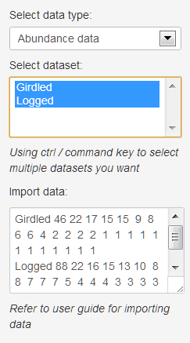
- 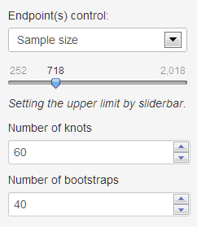
- 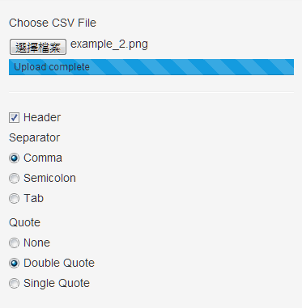

## 輸出元件範例

- 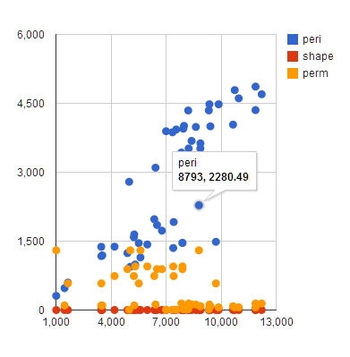
- 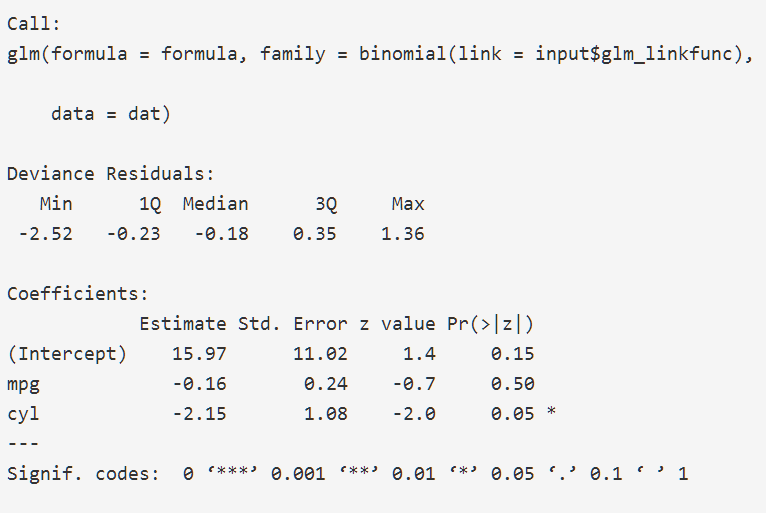
- 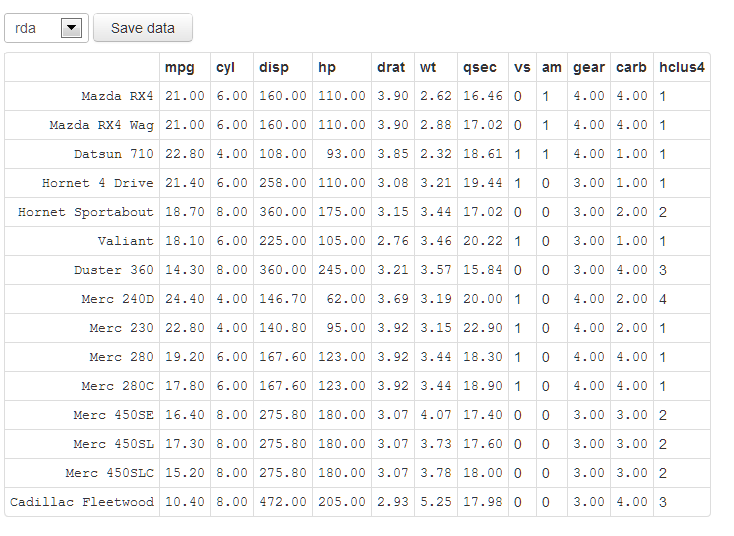
- 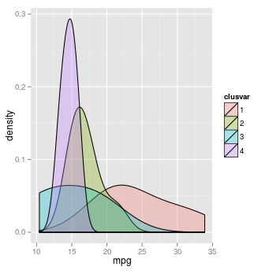

# Shiny網頁應用範例

使用者可以到<http://www.rstudio.com/shiny/showcase/>觀看其他開發者所開發的Shiny網頁應用。

如:

- 
- 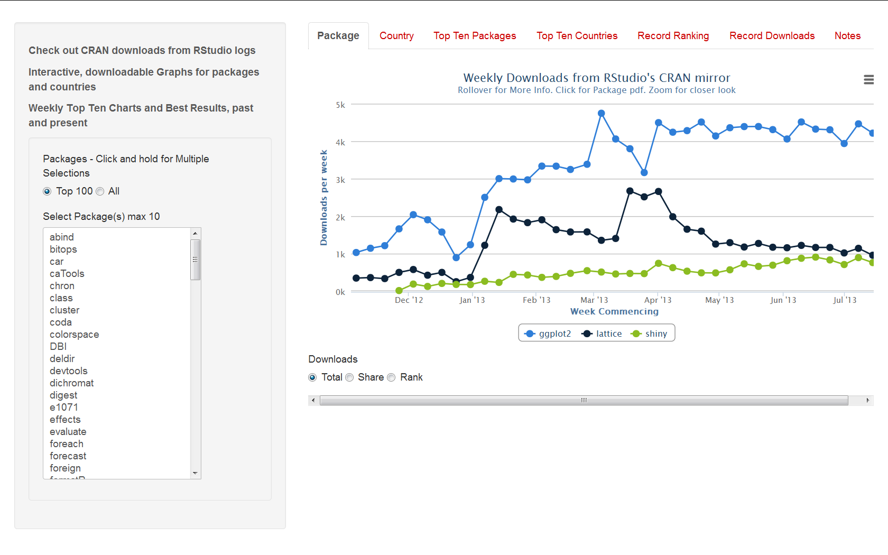
- 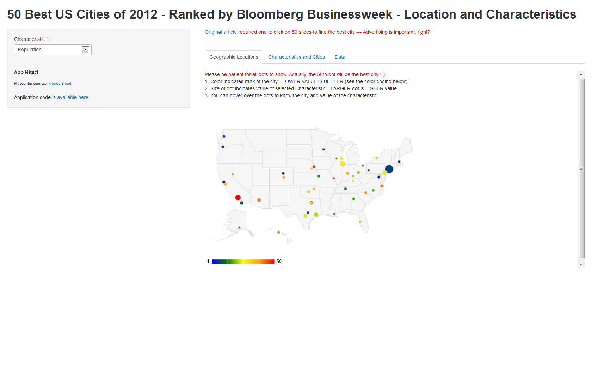
- 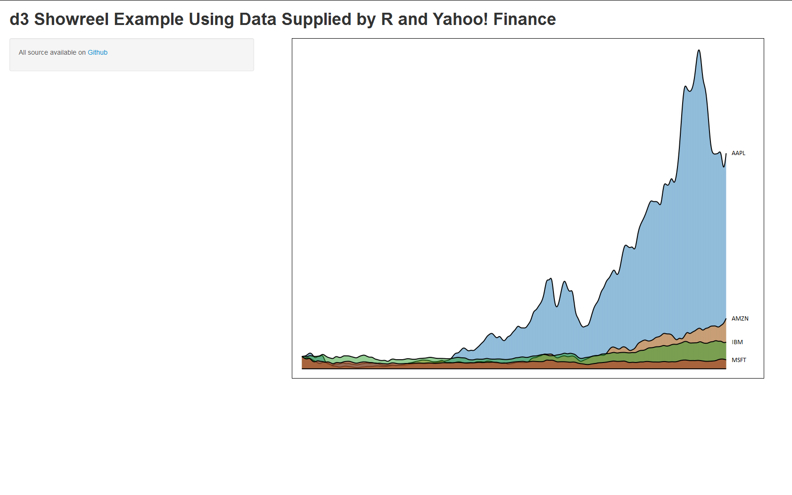
- 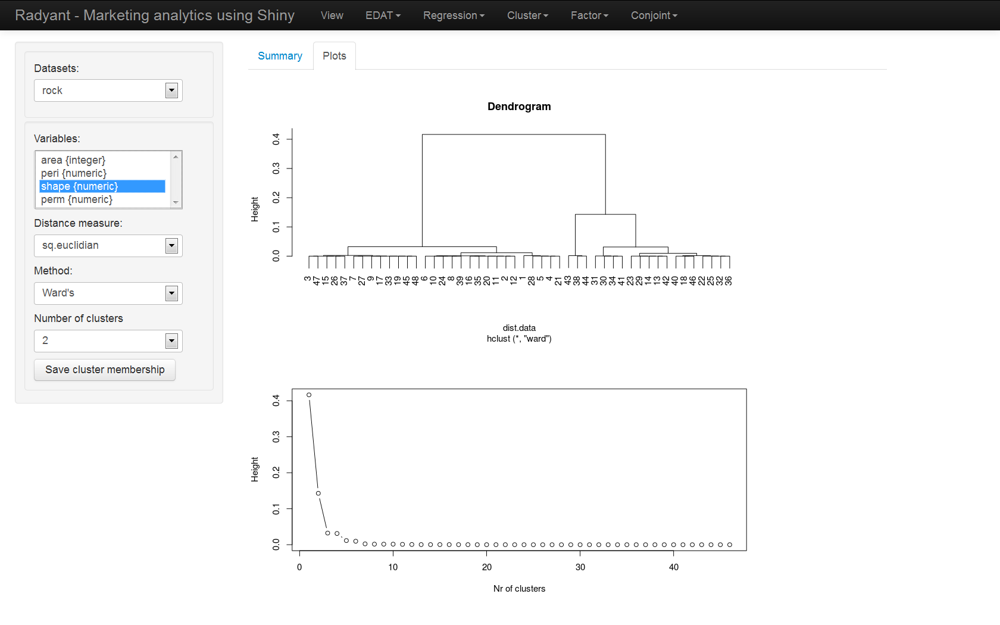
- 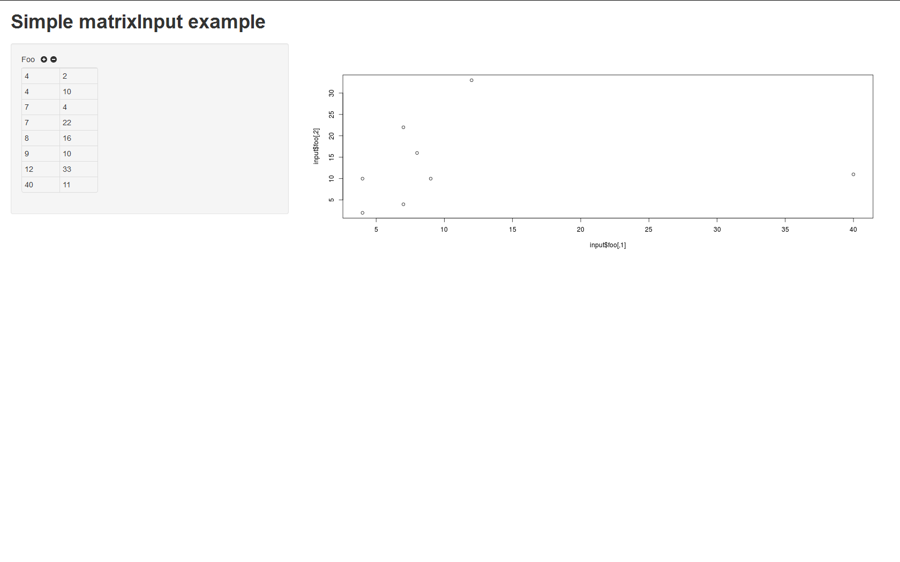

# 開發建議

讀者如果想試著開發Shiny應用，我們有以下的tips供讀者參考:

- 先從<http://rstudio.github.io/shiny/tutorial/>中找到符合需求的模版
- 把其他套件的載入，或資料源的設定，放置於`shinyUI`和`shinyServer`之前，如資料庫連線設定
- 先從ui.R開始建立使用者介面
- 網頁沒有回應，通常是ui.R有語法錯誤，`runApp`下方應該有錯誤訊息
- 在server.R中插入程式的核心演算法、分析方法。請務必理解server.R的架構，並且將功能正確的分為靜態的部份和動態的部份，才能將程式碼放置在正確的位置。靜態的部份放置於`shinyServer`之前，動態的部份會放在`reactive`，或對應的`renderXXX`裡
- 網頁有出現，但是`mainPanel`出現紅色錯誤訊息，代表server.R有錯誤
- 在server.R中插入`browser()`後，在`runApp`之後可以在執行相關事件時暫停在`browser`，開發者可以很方便的進行除錯

讀者如果對於基本的Shiny功能不滿意，可以在學習HTML/CSS/javascript後擴充Shiny網頁應用的功能。

# 佈署網頁應用

通常開發者撰寫出來的Shiny網頁應用可以依照以下方法來讓其他使用者使用:

## 直接傳遞相關檔案

開發者可以將撰寫好程式e-mail給使用者。

當使用者拿到相關檔案之後，仍需要有安裝R和Shiny，利用`runApp`來使用。

## 利用Github

開發者可以將撰寫好的ui.R和server.R放到github或gist。使用者仍需安裝R和Shiny，再利用`runGist`或`runGithub`來使用。

## Rstudio的Shiny伺服器

開發者可以到<https://rstudio.wufoo.com/forms/shiny-server-beta-program/>註冊，之後將撰寫好的ui.R和server.R上傳到Rstudio伺服器上。

使用者不需要安裝R，只需要打開瀏覽器後，連上相關網址就可以使用。

## 自行架設Shiny伺服器

請依照<https://github.com/rstudio/shiny-server>的說明建制Shiny伺服器。目前僅提供Linux版本。

建制完成後，使用者不需要安裝R，只需要打開瀏覽器，連上相關網址就可以使用。

# 參考資料

- Rstudio-Shiny 官方網站 <http://www.rstudio.com/shiny/>

# 作者

## T.C. Hsieh ([euler96@gmail.com](mailto:euler96@gmail.com))

- 清華統計所博士(2009-2013)，致力於發展沒人懂的統計方法與開發沒人用的統計軟體
- R 相關著作：
    - R套件，[CARE1](http://cran.r-project.org/web/packages/CARE1/index.html)主要作者
    - Shiny應用，[iNEXT-Online](http://glimmer.rstudio.com/tchsieh/inext/)
- 研究領域：Statistics, ecology and genetics

## Wush Wu ([wush978@gmail.com](mailto:wush978@gmail.com))

- [Taiwan R User Group](https://www.facebook.com/Tw.R.User) Organizer
- R 相關著作：
    - [RMessenger](http://cran.r-project.org/web/packages/RMessenger/index.html)的作者
    - [RSUS](https://bitbucket.org/wush_iis/rsus)，這是[On Shortest Unique Substring Query](http://www.cs.sfu.ca/~jpei/publications/MISQ_ICDE12.pdf)的實作
- 研究領域：Large Scale Learning，[Text Mining](http://www.cs.sfu.ca/~jpei/publications/MISQ_ICDE12.pdf)和[Uncertain Time Series](http://www.cs.sfu.ca/~jpei/publications/Shortest%20Unique%20Substring%20Queries%20ICDE13.pdf)
